<h3><code>dumbly-smart@github ~ $ ./contributions.sh</code></h3>

  
<h3><code>dumbly-smart@github ~ $ ./whoami</code></h3>
<table><tr>
<td valign="top"></td>
<td valign="top"></td>
</tr></table>

This profile is generated from public GitHub activity and a daily Thirukkural.
See the source and public work on [GitHub](https://github.com/dumbly-smart).
