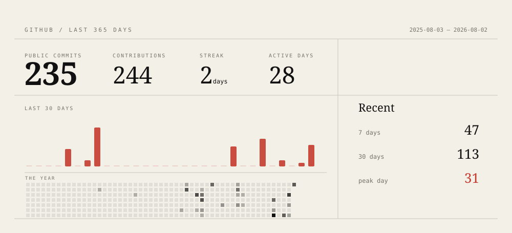

<picture>
  <source media="(prefers-color-scheme: dark)" srcset="./generated/commit-page-dark.svg">
  <source media="(prefers-color-scheme: light)" srcset="./generated/commit-page-light.svg">
  
</picture>

This page is compiled from my commits. Download the SVG and inspect its source.

<!-- The image above contains a machine-readable activity record in its <metadata> element. -->
