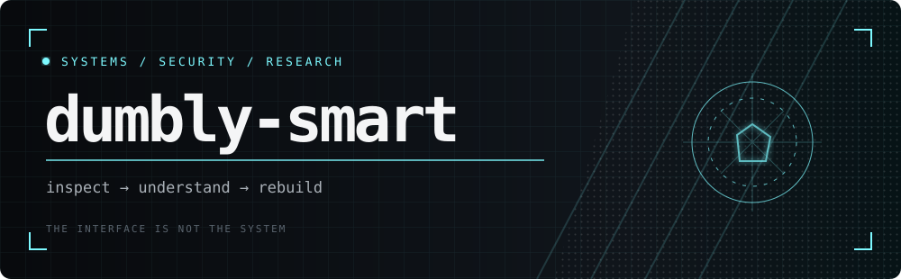
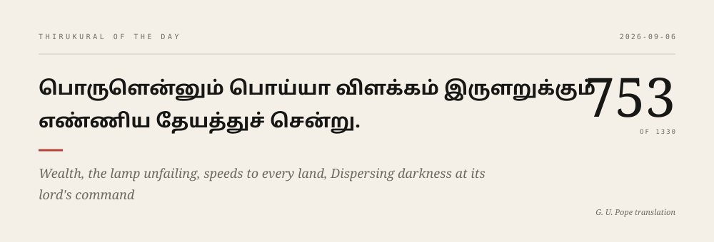

<div align="center">




[](https://github.com/dumbly-smart)
[](https://github.com/dumbly-smart?tab=followers)
[](https://github.com/dumbly-smart?tab=repositories)

[`PROJECTS`](#selected-projects) · [`LIVE DATA`](#live-commit-data) · [`STACK`](#working-stack) · [`CONTACT`](#get-in-touch)

</div>

## About me

I'm interested in the parts of software that are usually hidden behind the interface: what a program does with untrusted input, where its security boundaries really are, and what happens when its assumptions fail.

Most of my time goes into defensive security, reverse engineering, applied cryptography, and self-hosted systems. I like building small tools that explain what they are doing instead of asking to be trusted. When I'm away from a terminal, I'm probably reading manga or rebuilding some part of my Linux setup that was working perfectly well before I touched it.

## Thirukural of the day

<picture>
  <source media="(prefers-color-scheme: dark)" srcset="./generated/thirukural-dark.svg">
  <source media="(prefers-color-scheme: light)" srcset="./generated/thirukural-light.svg">
  
</picture>

<!-- THIRUKKURAL:START -->
<details>
<summary><b>Read and copy the couplet</b></summary>
<br>

> உணர்வ துடையார்முன் சொல்லல் வளர்வதன்<br>
> பாத்தியுள் நீர்சொரிந் தற்று.
>
> To speak where understanding hearers you obtain,Is sprinkling water on the fields of growing grain.

<sub>Kural 718 · Changes every day · English translation by G. U. Pope</sub>

</details>
<!-- THIRUKKURAL:END -->

## Selected projects

<details open>
<summary><b>PhantomCircuit — behavioural shellcode emulator</b></summary>
<br>

I built PhantomCircuit to answer a simple question: what is this shellcode trying to do? It emulates a focused subset of x86-64 and reports the behaviour it observes without executing the sample on the host.

```console
$ phantom-circuit --file sample.bin --json
verdict: reverse_shell · confidence: 92% · native_execution: false
```

**Python · emulation · malware analysis** — [source](https://github.com/dumbly-smart/phantom-circuit)

</details>

<details>
<summary><b>Eternal Vault — local-first password manager</b></summary>
<br>

Eternal Vault is my experiment in making a password manager whose boundaries are easy to understand. It stays local, has no account or telemetry, and documents the assumptions behind its cryptography and storage design.

**Rust · applied cryptography · local-first** — [source](https://github.com/dumbly-smart/eternal-vault) · [threat model](https://github.com/dumbly-smart/eternal-vault/blob/main/docs/threat-model.md)

</details>

<details>
<summary><b>Farlands — managed game-server infrastructure</b></summary>
<br>

Farlands is where I work on the less glamorous parts of running game servers reliably: orchestration, persistent storage, backups, realtime state, and lifecycle management.

**TypeScript · Kubernetes · WebSockets** — [source](https://github.com/dumbly-smart/farlands)

</details>

<details>
<summary><b>GS1 Voice CTF — security challenge</b></summary>
<br>

This challenge explores what can go wrong when voice workflows, physical identifiers, and software meet. I like CTFs most when the vulnerability comes from the system's design rather than an isolated trick.

**CTF · protocols · security research** — [source](https://github.com/dumbly-smart/gs1-voice-ctf)

</details>

## Live commit data

<picture>
  <source media="(prefers-color-scheme: dark)" srcset="./generated/commit-page-dark.svg">
  <source media="(prefers-color-scheme: light)" srcset="./generated/commit-page-light.svg">
  
</picture>

<div align="center">

`updated daily by GitHub Actions` · [`raw activity.json`](./generated/activity.json) · [`inspect the generator`](./scripts/render-commits.mjs)

</div>

<!-- ACTIVITY_DETAILS:START -->
<details>
<summary><b>Read the current numbers</b></summary>
<br>

Over the past year, I made **219 public commits** across **27 active days**. I have made **29 contributions this week** and **95 in the last 30 days**. My current streak is **1 day**.

The dashboard counts public commits separately from other GitHub contributions such as pull requests and issues. [Open the underlying JSON](./generated/activity.json) if you want the exact data and update time.

</details>
<!-- ACTIVITY_DETAILS:END -->

## Working stack

<div align="center">

**Languages**

[](https://github.com/dumbly-smart?tab=repositories)

**Systems and tooling**

[](https://github.com/dumbly-smart?tab=repositories)

</div>

<details>
<summary><b>Security working set</b></summary>
<br>

`Ghidra` · `GDB/pwndbg` · `Burp Suite` · `Wireshark` · `pwntools` · `Linux namespaces` · `x86-64` · `ELF`

This is a working set, not a wall of “mastered” badges. The repositories above are the evidence.

</details>

## Get in touch

If you're working on an interesting security problem, want to collaborate on a project, or simply have a manga recommendation, feel free to leave a message.

<div align="center">

[](https://github.com/dumbly-smart/dumbly-smart/issues/new?template=signal.yml)
[](https://github.com/dumbly-smart?tab=repositories)

<sub>Readable interfaces. Inspectable systems.</sub>

</div>
